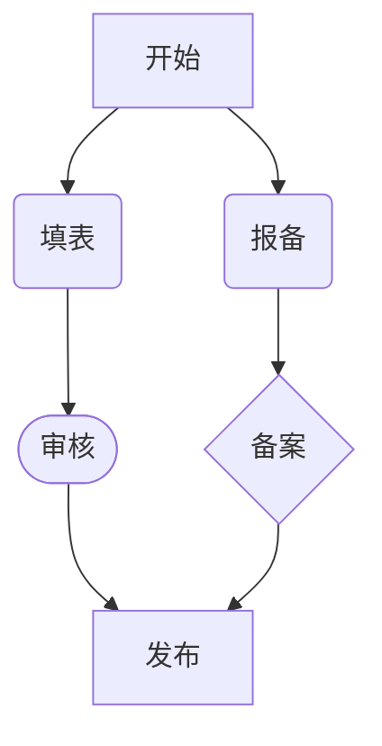

# MarkFlow MVP 阶段1：核心功能清单

## 1. 基础编辑体验

* **实时预览，双向同步**：Markdown源码与渲染内容实时同步，保持格式一致性

* **基本Markdown语法支持**：

  * 标题（# 至 ######）
  * 段落与换行
  * 粗体（**text**，__text__）与斜体（_text_，*text*）,同时加粗斜体（***text***,___text___）
  * 无序列表（-、\*、+）与有序列表（1.）
    - 无序列表1
    - 无序列表2
    - 无序列表3
      
    1. **项目1🐷**
    2. **项目2🐶**
    3. **项目3🐍🐅🐴🐎**
       
  * 任务列表（- \[ ]、- \[x]）
    - [x] 待完成任务
    - [x] 待完成任务
    - [x] 待完成任务
          
  * 代码块（\`\`\` language）与行内代码（`code`）


```java
package com.wuld.escort;

@Data
public class Person {
  private String name;
  private Long id;
  private Integer age;
  private Date birthday;
}
```

  * 引用区块（>）
    > 这是一个引用，来自哪里哪里
    
  * 链接（[text](https://chat.qwen.ai/c/url)）与图片

    [百度](https://www.baidu.com)

    
  * 水平线（---、\*\*\*）
  * 表格（符合GitHub Flavored Markdown标准）
    
| Header 1 | Header 2 | Header3 |
| -------- | -------- | ------- |
| Cell 1   | Cell 2   | Cell3   |
| Cell 21  | Cell 22  |         |
| Cell 31  | Cell 32  |         |

  * 脚注（\[^1]）
[^1]三尺剑，[^2]六钧[^7]弓。人间清暑殿[^3]，人间广寒宫[^4]。两岸晓烟杨柳绿[^5]，一园春雨杏花红[^6]。

[^4]: 人间广寒宫：嫦娥居所

[^3]: 人间清暑殿：洛阳城内。

[^1]: 《汉书》载，高祖刘邦被黥布流矢射中，医生说：“可以治好。”高祖说：“我提三尺剑来打天下，一切依靠命定。命数由上天掌握，即使是扁鹊这样的名医又能有什么用呢？”古代剑长为三尺，故称三尺剑。

[^2]: 此处指拉力较强的一种弓。钧，古代重量单位，三十斤为一钧。



这是一个行内公式：$E = mc^2$，它是爱因斯坦的质能方程。

圆的面积公式是 $A = \pi r^2$，其中 $r$ 是半径。

二次方程的解为：$x = \frac{-b \pm \sqrt{b^2 - 4ac}}{2a}$
## 复杂的数学公式
<!-- 时间复杂度 -->
$$O(1) < O(\log n) < O(n) < O(n \log n) < O(n^2) < O(2^n) < O(n!)$$

<!-- 递推关系 -->
$$T(n) = \begin{cases}
1 & \text{if } n = 1 \\
2T(n/2) + O(n) & \text{if } n > 1
\end{cases}$$

<!-- 主定理 -->
$$T(n) = aT(n/b) + f(n)$$
其中，$a \geq 1$，$b > 1$，$f(n)$ 是渐近正函数。

## 数学定理
<!-- 傅里叶变换 -->
$$\mathcal{F}\{f(t)\} = F(\omega) = \int_{-\infty}^{\infty} f(t) e^{-i\omega t} dt$$

<!-- 泰勒展开 -->
$$f(x) = \sum_{n=0}^{\infty} \frac{f^{(n)}(a)}{n!}(x-a)^n$$

<!-- 欧拉公式 -->
$$e^{i\theta} = \cos\theta + i\sin\theta$$

<!-- 高斯积分 -->
$$\int_{-\infty}^{\infty} e^{-ax^2} dx = \sqrt{\frac{\pi}{a}} \quad (a > 0)$$

<!-- 贝叶斯定理 -->
$$P(A|B) = \frac{P(B|A)P(A)}{P(B)}$$

## 物理公式
### 薛定谔方程
$$
i\hbar\frac{\partial}{\partial t}\Psi(\mathbf{r},t) = \hat{H}\Psi(\mathbf{r},t
)
$$
### 洛伦兹变换
$$
\begin{pmatrix}
ct' \\
x' \\
y' \\
z'
\end{pmatrix} = 
\begin{pmatrix}
\gamma & -\gamma v/c & 0 & 0 \\
-\gamma v/c & \gamma & 0 & 0 \\
0 & 0 & 1 & 0 \\
0 & 0 & 0 & 1
\end{pmatrix}
\begin{pmatrix}
ct \\
x \\
y \\
z
\end{pmatrix}
$$


[^5]: 两岸晓烟

[^6]: 医院春雨

[^7]: 钧：古代计量单位，三十斤为一钧。