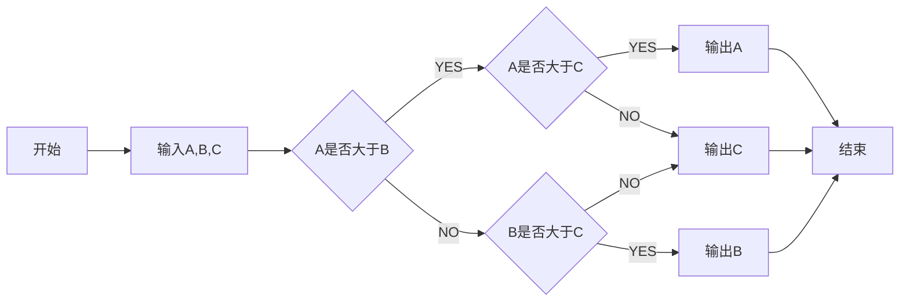

# MarkFlow MVP 阶段1：核心功能清单

## 1. 基础编辑体验

* **实时预览，双向同步**：Markdown源码与渲染内容实时同步，保持格式一致性

* **基本Markdown语法支持**：

  * 标题（# 至 ######）
  * 段落与换行
  * 粗体（**text**，__text__）与斜体（_text_，*text*）,同时加粗斜体（***text***,___text___）
  * 无序列表（-、\*、+）与有序列表（1.）
    1. **项目1🐷**
    2. **项目2🐶**
    3. **项目3🐍🐅🐴🐎**
  * 任务列表（- \[ ]、- \[x]）
    - [x] 待完成任务
    - [x] 待完成任务
    - [x] 待完成任务
    **其他的**
  * 代码块（\`\`\` language）与行内代码（`code`）


```java
package com.wuld.escort;

@Data
public class Person {
  private String name;
  private Long id;
  private Integer age;
  private Date birthday;
}
```

  * 引用区块（>）
    > 这是一个引用，来自哪里哪里
    >> 嵌套引用
    >>>更深的嵌套
    >>>>再一层嵌套
  * 链接（[text](https://chat.qwen.ai/c/url)）与图片

    [百度](https://www.baidu.com)
  * 水平线（---、\*\*\*）
  * 表格（符合GitHub Flavored Markdown标准）
    
| Header 1 | Header 2 | Header3 |
| -------- | -------- | ------- |
| Cell 1   | Cell 2   | Cell3   |
| Cell 21  | Cell 22  |         |
| Cell 31  | Cell 32  |         |

  * 脚注（\[^1]）
[^1]三尺剑，[^2]六钧[^7]弓。人间清暑殿[^3]，人间广寒宫[^4]。两岸晓烟杨柳绿[^5]，一园春雨杏花红[^6]。

[^4]: 人间广寒宫：嫦娥居所

[^3]: 人间清暑殿：洛阳城内。

[^1]: 《汉书》载，高祖刘邦被黥布流矢射中，医生说：“可以治好。”高祖说：“我提三尺剑来打天下，一切依靠命定。命数由上天掌握，即使是扁鹊这样的名医又能有什么用呢？”古代剑长为三尺，故称三尺剑。

[^2]: 此处指拉力较强的一种弓。钧，古代重量单位，三十斤为一钧。




[^5]: 两岸晓烟

[^6]: 医院春雨

[^7]: 钧：古代计量单位，三十斤为一钧。